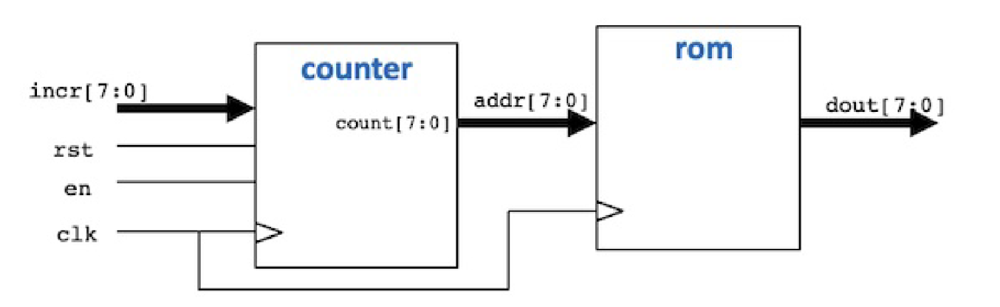

# Logbook LAB 2:
## Task 1: 
- [Logbook LAB 2:](#logbook-lab-2)
  - [Task 1:](#task-1)
    - [What I did:](#what-i-did)
    - [Challenge:](#challenge)
    - [Problems encountered:](#problems-encountered)
    - [Other reflexions:](#other-reflexions)

### What I did: 
* Created a rom module 258x8 bits. 


* __sinegen.py__ file generates values for a sinusoidal wave within a 255 range, equivalent to the number of bits of memeory available in the ROM. The values are saved in __sinerom.mem__
* Added Vbuddy Hex counter display to the test bench 
* Created the sinegen.sv module: It includes 2 components;
  * counter.sv (From previous lab)
  * rom.sv (Newly created)



* Created a testbench from scratch. This testbench is inspired by the __counter_tb.cpp__
  * It plots the values outputed by the ROM (sinewave) for 1,000,000 cycles. 
  * Because it has a very large number of cycles I had to add an 'elegant' way to exit the program using: _vdbGetKey()_, this method exits the program when a specified key is pressed. 
* Modified the doit.sh to accomodate the new sinegen files. 

---

### Challenge:

The goal of the challenge was to be able to change the frequency of the sinewave using the method *vbdValue()*, the value outputed by this method is linked with the rotary switch. 

To do this I needed to specify the incr parameter in the **counter.sv** file as being an 8-bit input. 
Then in the Flip-Flop code I change the if else statement to be: 
```sv
always_ff @(posedge clk)
    if (rst) count <= {WIDTH{1'b0}};
    else     count <= en ? count + incr : count ;
```
**Translation**: 
1. If enable is true: count + increment 
* --> This changes the 'frequency' of the sinewave as the values ouputed by the ROM won't be as continuous as with an increment of 1

1. Else count keep the value of count 
* --> Nothing happens as the value outputed by the ROM won't be changing. 


Then I had to add the increment value in the testbench: 
```cpp
top->incr = int((vbdValue() / 100.0) * 255);
```
**Translation**: 
Because the *vbdValue()* method only outputs floats between 0-100. And knowing that the TFT display accepts 8 bits. I had to: 
1. Change the type to *int()*
1. Divide *vbdValue()* by 100 and multiply it by 255

When I run this I get this waveform: 


Another feature that I added was to attach the *vbdFlag()* to the enable pointer to be able to stop the waveform 

---
### Problems encountered:

1. When running **vbuddy.cfg** no spaces after the COM port number 
1. When using the rotary switch at a too low value the processor would crash with the error: 
```Bash
terminate called after throwing an instance of 'std::out_of_range'
Aborted (core dumped)
```
This happens because the frequency became too high and the processor couldn't handle it anymore. 

---
### Other reflexions: 

_None_

